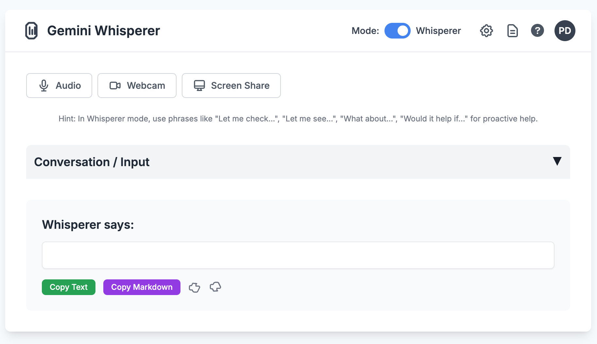

# Gemini Whisperer

An ambient, always on AI assistant that listens silently in the background and show contextual information on conversations and tasks While using our devices for tasks, learning through videos, or engaging in online conversations, we frequently seek additional details about specific topics.
Imagine an ever-present, ambient AI that anticipates your needs and offers relevant information or assistance proactively.
This would eliminate the need to switch between applications or windows, allowing for a smooth continuation of your current task or conversation.

**Modes (Whisper vs. Live):** The application can operate in two main modes, affecting how the AI responds:
- **Whisper Mode (Default):** Designed for more subtle, cued interaction. The AI primarily responds when specific verbal cues are detected in your speech. It aims to be less intrusive and will often remain silent unless cued. 
You can use verbal cues such as:
  - "Let me check..."
  - "Let me see..."
  - "What about..."
  - "Would it help if..."

  These phrases can help the AI anticipate when you might be looking for information. 
-   **Live Mode:** In this mode, the AI is more generally proactive. It listens for relevant topics or implicit needs in your ongoing conversation and may offer information or assistance without explicit verbal cues. The goal is still to be helpful and anticipate needs, but with a broader trigger for engagement compared to Whisper Mode.

## Key Features

- **Proactive Assistance:** AI is guided by system instructions to listen and offer information proactively.
- **Text-Based Interaction:** Primarily uses text for communication with the Gemini model.
- **Voice, Webcam, and Screen Share Inputs:** Supports user input via microphone, camera, and screen sharing.

## Prerequisites

- Google AI Studio API key for the Gemini API.
- Node.js and npm (for running the build script).
- A local HTTP server to run the bundled `dist/gemini_live_app.html` file (e.g., `npx serve`, Python's `http.server`, or VS Code Live Server extension). This is necessary for `localStorage` access (API keys, settings) to persist.

## Project Setup

1.  **Clone the Repository (if applicable):**
    If you've obtained this project as a set of files, ensure they are in a dedicated directory. 

2.  **Run the Setup Script:**
    The easiest way to install dependencies is to use the provided setup script. Make it executable and run it:

    ```bash
    chmod +x setup.sh
    ./setup.sh
    ```

    This script will check for Node.js and npm, and then install the required project dependencies.

    **Alternatively, Manual Installation:**
    If you prefer or if the script doesn't suit your environment, you can install dependencies manually after ensuring Node.js and npm are installed:

    ```bash
    npm install
    ```

    This will install packages listed in `package.json` (currently `terser` and `csso` for the build process).

## Building the Project

To bundle and prepare the application for use (including minifying CSS and JavaScript), run the build script:

```bash
node build.js
```

This command will:

- Process and concatenate JavaScript files.
- Minify JavaScript and CSS.
- Inline all assets into a single HTML file.
- The output will be created at `dist/gemini_live_app.html`.

## Running the Application

1.  **Open the built file:**
    After a successful build, open the `dist/gemini_live_app.html` file in a modern web browser.

2.  **Serving Locally (Recommended for Full Functionality):**
    For all features to work correctly, especially saving API keys and settings (which use `localStorage`), it's recommended to serve the `dist` directory using a local HTTP server.

    - Using Python:
      ```bash
      cd dist
      python3 -m http.server
      ```
      Then open `http://localhost:8000/gemini_live_app.html` in your browser.
    - Using `npx serve` (Node.js required):
      ```bash
      npx serve dist
      ```
      Then open the URL provided by `serve` (usually `http://localhost:3000`, and navigate to `gemini_live_app.html`).
    - Using VS Code Live Server extension if you are developing.


## UI Overview

- **Controls:** Buttons/tabs for Audio (microphone), Webcam, and Screen Share allow you to manage your input streams.
- **Collapsible Chat/Input:** The main section for text input and viewing conversation history can be collapsed/expanded by clicking its header ("Conversation / Input"). It starts collapsed to encourage voice/media-first interaction.
- **Current Output:** A dedicated area shows the live, streaming response from Gemini. This content persists until a new response from Gemini begins.
- **Conversation History:** Below the text input (when expanded), a log of the conversation is maintained.

### Screenshot



## Contributing

Contributions are welcome! Please feel free to submit issues and pull requests.

## License

This project is licensed under the MIT License.
